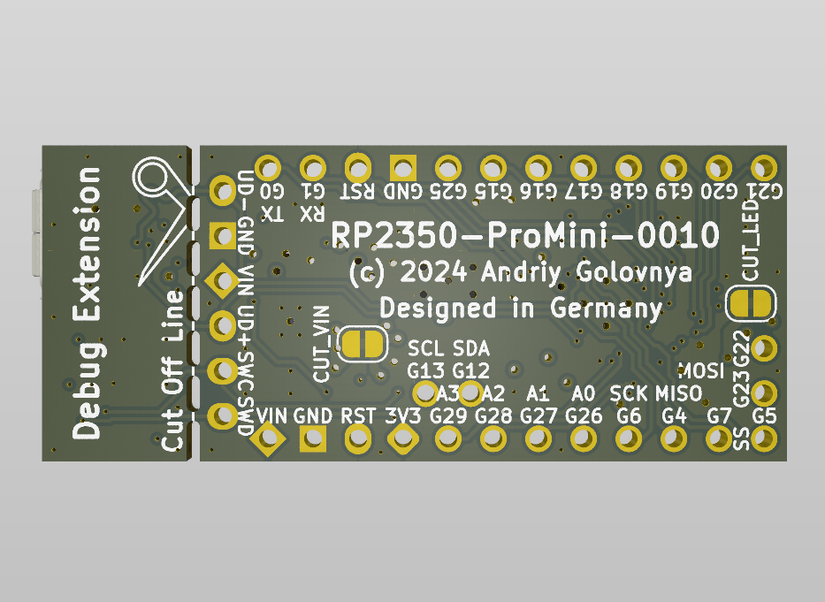
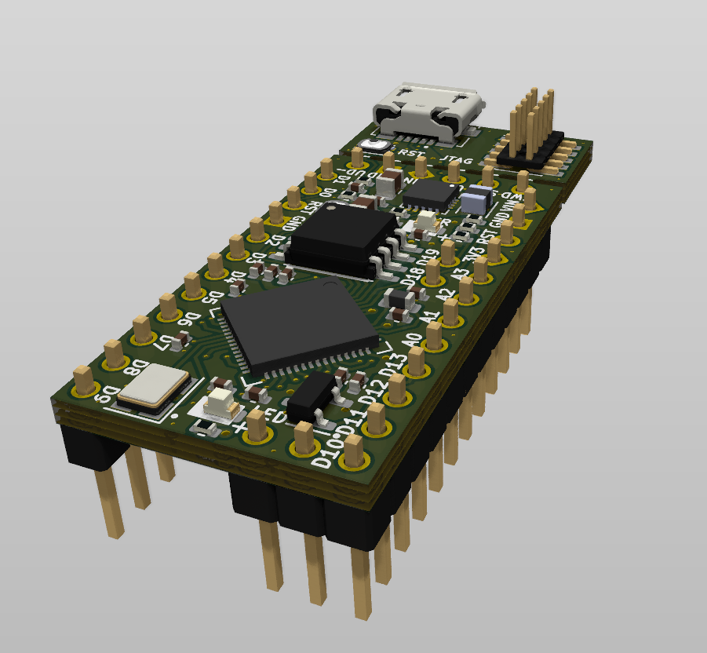
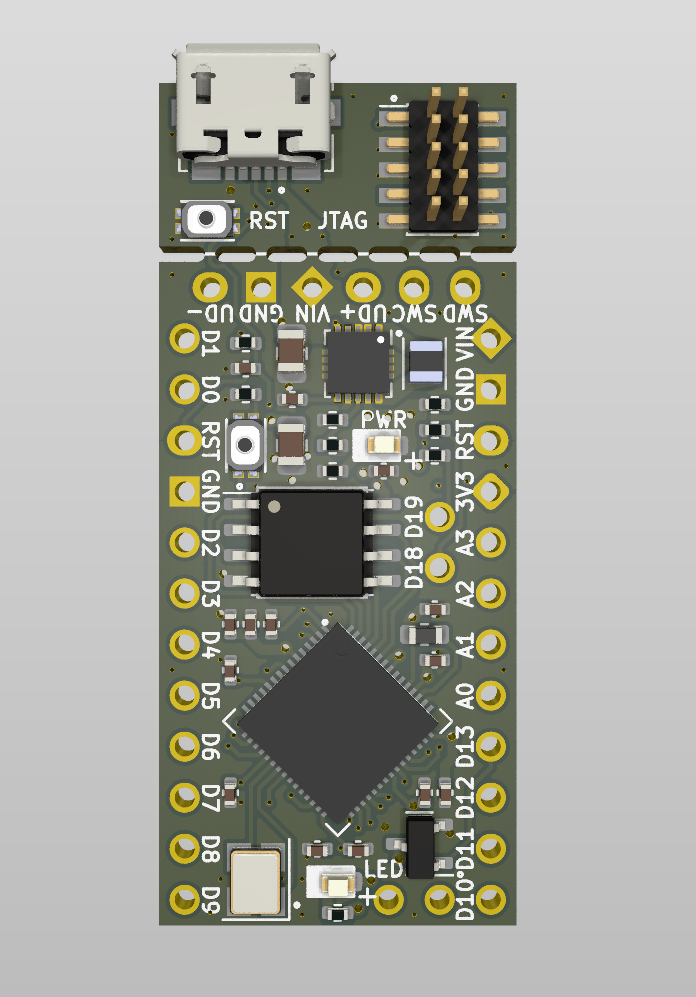

```
 ######  ######   #####   #####  #######   ###         ######                #     #            
 #     # #     # #     # #     # #        #   #        #     # #####   ####  ##   ## # #    # # 
 #     # #     #       #       # #       #     #       #     # #    # #    # # # # # # ##   # # 
 ######  ######   #####   #####  ######  #     # ##### ######  #    # #    # #  #  # # # #  # # 
 #   #   #       #             #       # #     #       #       #####  #    # #     # # #  # # # 
 #    #  #       #       #     # #     #  #   #        #       #   #  #    # #     # # #   ## # 
 #     # #       #######  #####   #####    ###         #       #    #  ####  #     # # #    # # 
```

# RP2350-ProMini Project

The RP2350-ProMini project aims to create a replacement for the Arduino Pro Mini using the RP2350 MCU.

## RP2350-ProMini Board

The **RP2350-ProMini** board is a 4-layer board designed to accommodate the popular Raspberry Pi RP2350 MCU in the commonly used, but obsolete, Arduino Pro Mini footprint.

This project is a shoot-off from my earlier [RP2040-ProMini](https://github.com/red-scorp/RP2040-ProMini) project, which was designed to accommodate the Raspberry Pi RP2040 MCU in the same footprint.

Preview:





You can view the [Schematics in PDF format](doc/RP2350-ProMini.pdf) for detailed information.

STEP 3D files are available [with pins](doc/RP23540-ProMini-with-pins.step) and [without pins](doc/RP2350-ProMini-board.step).

Features:

- Arduino Pro Mini compatible pinout
- Partially compatible with Arduino Nano RP2040 Connect pinout
- Detachable USB and JTAG extension board with RESET button
- Dual-core Cortex-M33 Raspberry Pi RP2350
- Small footprint suitable for DIY projects
- 21 GPIO pins, including 4 analog inputs
- USB data pins on the side connector
- SWD debugging pins on the side connector
- Buck-Boost converter based 3.3V power supply with input range of 2.5V-12V
- Supports both SOIC and WSON 16MB flash packages
- Flat back side enables use as a sub-assembly
- Two cut points to reduce power consumption of unused components

CAM files, as well as the BOM and CPL files for JLCPCB, are available.

### Board Pinout

Following pinout is used for the board:

| Board Pin | RP2040 Pin | Function | Notes |
| --------- | ---------- | -------- | ----- |
| D0        | GPIO1      | UART0 TX |       |
| D1        | GPIO0      | UART0 RX |       |
| D2        | GPIO25     |          |       |
| D3        | GPIO15     |          |       |
| D4        | GPIO16     |          |       |
| D5        | GPIO17     |          |       |
| D6        | GPIO18     |          |       |
| D7        | GPIO19     |          |       |
| D8        | GPIO20     |          |       |
| D9        | GPIO21     |          |       |
| D10       | GPIO5      | SS       |       |
| D11       | GPIO7      | MOSI     |       |
| D12       | GPIO4      | MISO     |       |
| D13       | GPIO6      | SCK      | LED   |
| D14 A0    | GPIO26     |          |       |
| D15 A1    | GPIO27     |          |       |
| D16 A2    | GPIO28     |          |       |
| D17 A3    | GPIO29     |          |       |
| D18       | GPIO12     | SDA      |       |
| D19       | GPIO13     | SCL      |       |
| D20       | GPIO22     |          |       |
| D21       | GPIO23     |          |       |

### Cut Points

There are two cut points on the board to reduce power consumption of unused components.

| Cut Point | Function | Notes |
| --------- | -------- | ----- |
| CUT_VIN   | Separates VIN-to-3V3 power supply with power LED from the rest of the board | This cut point is useful if you want to power the board from 3V3 pin instead of VIN pin. |
| CUT_LED   | Separates LED on pin D13 from the rest of the board | This cut point is useful if you want to reduce power consumption of the board. |

## Version History

### v1.0b1 - xx.xx.2024



Initial release for testing purposes.

## Links

- [Raspberry Pi RP2350 information page](https://www.raspberrypi.com/documentation/microcontrollers/silicon.html#rp2350).
- [Arduino Pro Mini information page](https://docs.arduino.cc/retired/boards/arduino-pro-mini).
- [Arduino Nano RP2040 Connect page](https://docs.arduino.cc/hardware/nano-rp2040-connect).
- [Arduino SDK for RP2040/RP2350 board](https://github.com/earlephilhower/arduino-pico).

## How to Help

Your contributions as code, resources, or finances are welcome! Please contact me directly via email at andriy.golovnya@gmail.com or through my [GitHub profile](https://github.com/red-scorp).

If you'd like to make a financial contribution, you can donate via [PayPal](http://paypal.me/redscorp) or [Ko-Fi](http://ko-fi.com/redscorp). Your support is greatly appreciated.

Thanks in advance!
